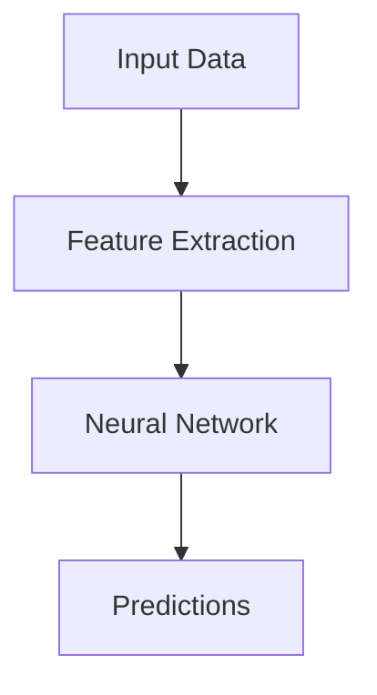

# ✍️ Content Authoring Guide (`CONTENT.md`)

This guide details how to write, structure, name, and organize content across all Astro content collections in `academicpages-astro`.

---

## 1. Directory Structure & File Naming Conventions

All content collections live in `src/content/`. Astro Content Layer validates every entry against schemas defined in [`src/content.config.ts`](file:///src/content.config.ts).

| Collection       | Directory                   | Recommended Naming             | URL Route                    |
| :--------------- | :-------------------------- | :----------------------------- | :--------------------------- |
| **Publications** | `src/content/publications/` | `YYYY-MM-DD-paper-title.md`    | `/publications/[...slug]/`   |
| **Talks**        | `src/content/talks/`        | `YYYY-MM-DD-talk-title.md`     | `/talks/[...slug]/`          |
| **Teaching**     | `src/content/teaching/`     | `YYYY-semester-course-name.md` | `/teaching/[...slug]/`       |
| **Portfolio**    | `src/content/portfolio/`    | `project-name.md`              | `/portfolio/[...slug]/`      |
| **Blog Posts**   | `src/content/blog/`         | `YYYY-MM-DD-post-title.md`     | `/posts/[...slug]/`          |
| **Pages**        | `src/content/pages/`        | `page-slug.md`                 | Rendered on dedicated routes |

---

## 2. Publications (`src/content/publications/`)

Research papers, preprints, books, and conference articles.

### Template Frontmatter

```yaml
---
title: High-Throughput Learning of Neural Potentials
date: 2026-03-15
description: A scalable deep learning framework for molecular dynamics
category: journals # Options: 'books', 'journals', 'conferences'
venue: Nature Machine Intelligence
citation: 'Doe, J., & Smith, A. (2026). "High-Throughput Learning of Neural Potentials." <i>Nature Machine Intelligence</i>, 8(3), 200-215.'
pdf_url: /files/paper1.pdf # Direct download or external URL (fallback: paper_url)
slides_url: /files/slides1.pdf # Optional slides URL
code_url: https://github.com/username/project # Optional repository link
bibtex: |
  @article{Doe2026,
    title   = {High-Throughput Learning of Neural Potentials},
    author  = {Doe, Jane and Smith, Alex},
    journal = {Nature Machine Intelligence},
    year    = {2026},
    volume  = {8},
    pages   = {200--215}
  }
author_profile: true # Optional (default: true)
toc: false # Optional: show Table of Contents (default: false)
---
Detailed abstract, methodology, results, and discussion go here. Standard Markdown, figures, and KaTeX math ($E=mc^2$) are fully supported.
```

### Publication Features

- **1-Click BibTeX**: The `bibtex` property automatically renders an interactive pill badge that copies citation text to the clipboard
- **Action Badges**: `pdf_url`, `slides_url`, and `code_url` are automatically rendered as accessible, branded action pills (`[PDF]`, `[Slides]`, `[Code]`)
- **Scholarly SEO**: Populates Google Scholar and Highwire Press citation tags automatically (`citation_title`, `citation_publication_date`, `citation_journal_title`, `citation_pdf_url`)

---

## 3. Talks & Presentations (`src/content/talks/`)

Keynotes, conference talks, seminar presentations, and tutorials.

### Template Frontmatter

```yaml
---
title: Scalable Graph Transformers for Protein Design
date: 2026-05-20
description: Keynote presentation on graph representation learning in biology
type: Keynote Talk # e.g. 'Conference Talk', 'Workshop Tutorial', 'Keynote Talk'
venue: International Conference on Machine Learning (ICML 2026), Vienna, Austria
slides_url: /files/slides2.pdf # Optional slides download link
author_profile: true
---
Talk summary, abstract, slide embed, or related video links.
```

---

## 4. Teaching (`src/content/teaching/`)

Undergraduate and graduate courses, guest lectures, and workshops.

### Template Frontmatter

```yaml
---
title: 'CS 229: Machine Learning & Scientific Computing'
year: 2026
semester: Spring # Options: 'Autumn', 'Fall', 'Spring', 'Summer', 'Winter'
description: Graduate-level introduction to statistical learning and optimization
type: Graduate Course # e.g. 'Undergraduate Course', 'Graduate Course', 'Workshop'
venue: Department of Computer Science, University of Science
author_profile: true
---
Course syllabus, grading policy, office hours, and lecture materials.
```

---

## 5. Portfolio Projects (`src/content/portfolio/`)

Software libraries, datasets, open-source projects, and research artifacts.

### Template Frontmatter

```yaml
---
title: Project Title
date: 2025-08-01
timeline: Aug 2025 – Present
venue: Organization / University Name
description: Brief summary of the project goals and accomplishments
pdf_url: https://example.com/paper.pdf
slides_url: https://example.com/slides.pdf
code_url: https://github.com/username/project
image: /images/portfolio-preview.png # Optional card banner image
author_profile: true
---
Overview of the project, features, architectural diagram, and installation guide.
```

---

## 6. Blog Posts (`src/content/blog/`)

Articles, research thoughts, and release announcements.

### Template Frontmatter

```yaml
---
title: Accelerating Scientific Discovery with Agentic AI
date: 2026-04-10
modified: 2026-04-12 # Optional last modified date
description: How AI pair programmers streamline scientific experimentation
tags:
  - AI
  - Research
  - Tooling
draft: false # Set true to hide from listing and RSS feeds
read_time: true # Show estimated reading time (default: true)
toc: true # Display retractable Table of Contents on desktop
author_profile: true
---
Post content with full Markdown, math equations, code blocks, and diagrams.
```

---

## 7. Static Pages (`src/content/pages/`)

Static markdown pages for institutional requirements or reference guides.

- `about.md`: Legacy bio page (note: default homepage is `src/pages/index.astro`)
- `terms.md`: Terms of service, copyright, or privacy notices (`/terms/`)
- `markdown.md`: Starter Markdown formatting demo (`/markdown/`, deleted during setup)

### Frontmatter

```yaml
---
title: Terms of Use & Privacy
description: Privacy policy and licensing terms for this website
author_profile: true
toc: false
---
```

---

## 8. Rich Media & Mathematical Formatting

For the complete visual syntax guide, see [`docs/MARKDOWN.md`](file:///docs/MARKDOWN.md) or the [live demo](https://arghyadipchak.github.io/academicpages-astro/markdown/).

### KaTeX Mathematics (Server-Side)

- **Inline math**: Wrap LaTeX in `$ ... $`, e.g. `$f(x) = \sigma(W x + b)$`
- **Display math**: Wrap LaTeX in `$$ ... $$` or `\[ ... \]` on its own line:
  ```latex
  $$
  \mathcal{L}_{\text{total}} = \mathcal{L}_{\text{task}} + \lambda \sum_{i=1}^N \|\theta_i\|_2^2
  $$
  ```

### Code Blocks & Copy Button

Fenced code blocks with language tags automatically receive Shiki syntax highlighting (matching light/dark themes) and an integrated copy-to-clipboard button:

````markdown
```python
def predict(weights: np.ndarray, x: np.ndarray) -> np.ndarray:
    return np.dot(x, weights)
```
````

### Notice Callouts

Create styled callout boxes matching classic Academic Pages:

```markdown
{: .notice}
Default informative note.

{: .notice--info}
Helpful tip or background context.

{: .notice--warning}
Warning or limitation to be aware of.

{: .notice--danger}
Critical error or deprecation alert.

{: .notice--success}
Success message or positive outcome.
```

### Diagrams (Mermaid)

Mermaid diagrams are automatically rendered and theme-synchronized:

````markdown

````
