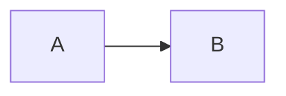
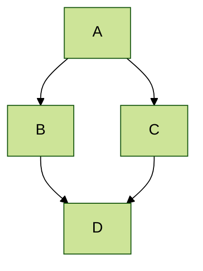

## Locations of key files & directories

- **Site Configuration & Author Profile**: `src/data/siteConfig.ts`
- **Top Navigation Bar**: `src/data/navigation.ts`
- **Global Design Tokens & Styles**: `src/styles/global.css`
- **Content Collections**:
  - `src/content/publications/`
  - `src/content/portfolio/`
  - `src/content/blog/`
  - `src/content/teaching/`
  - `src/content/talks/`
  - `src/content/pages/`
- **Static Assets & Downloads**:
  - `public/files/` (PDFs, slide decks, BibTeX `.bib` files)
  - `public/images/` (Avatar `profile.png`, favicons, screenshots)

## Tips and hints

- Create `.md` or `.mdx` files inside `src/content/<collection>/` to automatically generate pages with strict type checking
- Every commit pushed to GitHub automatically triggers the `.github/workflows/ci.yml` action to compile static assets and deploy to GitHub Pages
- Standard GitHub Flavored Markdown (GFM), footnotes, task lists, and autolinks are natively supported by Astro
- Your CV page is rendered from `src/pages/cv.astro` with an interactive, sticky Table of Contents

## KaTeX & LaTeX Math

Academic Pages Astro includes built-in server-side rendering for mathematical equations using [KaTeX](https://katex.org/). Equations are compiled into HTML & MathML at build time with zero client JavaScript overhead:

### Display Equations

Multiline aligned systems using `$$...$$` and `\begin{aligned}`:

$$
\begin{aligned}
\nabla \cdot E &= \frac{\rho}{\epsilon_0} \\
\nabla \cdot B &= 0 \\
\nabla \times E &= -\partial_t B \\
\nabla \times B &= \mu_0 \left(J + \varepsilon_0 \partial_t E \right)
\end{aligned}
$$

Standard displayed formulas:

$$
\int_{-\infty}^{\infty} e^{-x^2} dx = \sqrt{\pi}
$$

### Inline Equations

Use standard `$ ... $` delimiters for inline mathematics, such as the Pythagorean theorem $a^2 + b^2 = c^2$, Euler's identity $e^{i\pi} + 1 = 0$, or summation $\sum_{i=1}^n i = \frac{n(n+1)}{2}$.

## Mermaid diagrams

Academic Pages includes support for [Mermaid diagrams](https://mermaid.js.org/) (version 11.* via [jsDelivr](https://www.jsdelivr.com/)) and in addition to their [tutorials](https://mermaid.js.org/ecosystem/tutorials.html) and [GitHub documentation](https://github.com/mermaid-js/mermaid) the basic syntax is as follows:



Which produces the following plot with the [default theme](https://mermaid.js.org/config/theming.html) applied:


While a more advanced plot with the `forest` theme applied looks like the following:



## Plotly

Academic Pages includes support for Plotly diagrams via a hook in the Markdown code elements, although those that are comfortable with HTML and JavaScript can also access it directly [via those routes](https://plotly.com/javascript/getting-started/). Plotly is included via an `npm` [package](https://www.npmjs.com/package/plotly.js?activeTab=readme) and is lazy loading is used in the template to retrieve the minimized JavaScript via a content delivery network (CDN) when a plot needs to be rendered on a page in the template.

In order to render a Plotly plot via Markdown the relevant plot data need to be added as follows:

```json
{
  "data": [
    {
      "x": [1, 2, 3, 4],
      "y": [10, 15, 13, 17],
      "type": "scatter"
    },
    {
      "x": [1, 2, 3, 4],
      "y": [16, 5, 11, 9],
      "type": "scatter"
    }
  ]
}
```

<div class="notice notice--warning">
  <strong>Important!</strong> Since the data is parsed as JSON <em>all</em> of the keys will need to be quoted for the plot to render. The use of a tool like <a href="https://jsonlint.com/" target="_blank" rel="noopener noreferrer">JSONLint</a> to check syntax is highly recommended
</div>

Which produces the following:

```plotly
{
  "data": [
    {
      "x": [1, 2, 3, 4],
      "y": [10, 15, 13, 17],
      "type": "scatter"
    },
    {
      "x": [1, 2, 3, 4],
      "y": [16, 5, 11, 9],
      "type": "scatter"
    }
  ]
}
```

Essentially what is taking place is that the [Plotly attributes](https://plotly.com/javascript/reference/index/) are being taken from the code block as JSON data, parsed, and passed to Plotly along with a theme that matches the current site theme (i.e., a light theme, or a dark theme). This allows all plots that can be described via the `data` attribute to rendered with some limitations for the theme of the plot.

```plotly
{
  "data": [
    {
      "x": [1, 2, 3, 4, 5],
      "y": [1, 6, 3, 6, 1],
      "mode": "markers",
      "type": "scatter",
      "name": "Team A",
      "text": ["A-1", "A-2", "A-3", "A-4", "A-5"],
      "marker": { "size": 12 }
    },
    {
      "x": [1.5, 2.5, 3.5, 4.5, 5.5],
      "y": [4, 1, 7, 1, 4],
      "mode": "markers",
      "type": "scatter",
      "name": "Team B",
      "text": ["B-a", "B-b", "B-c", "B-d", "B-e"],
      "marker": { "size": 12 }
    }
  ],
  "layout": {
    "xaxis": {
      "range": [ 0.75, 5.25 ]
    },
    "yaxis": {
      "range": [0, 8]
    },
    "title": {"text": "Data Labels Hover"}
  }
}
```

```plotly
{
  "data": [{
      "x": [1, 2, 3],
      "y": [4, 5, 6],
      "type": "scatter"
    },
    {
      "x": [20, 30, 40],
      "y": [50, 60, 70],
      "xaxis": "x2",
      "yaxis": "y2",
      "type": "scatter"
  }],
  "layout": {
    "grid": {
      "rows": 1,
      "columns": 2,
      "pattern": "independent"
    },
    "title": {
      "text": "Simple Subplot"
    }
  }
}
```

```plotly
{
  "data": [{
		"z": [[10, 10.625, 12.5, 15.625, 20],
          [5.625, 6.25, 8.125, 11.25, 15.625],
          [2.5, 3.125, 5.0, 8.125, 12.5],
          [0.625, 1.25, 3.125, 6.25, 10.625],
          [0, 0.625, 2.5, 5.625, 10]],
		"type": "contour"
	}],
  "layout": {
    "title": {
      "text": "Basic Contour Plot"
    }
  }
}
```

## Markdown Syntax Guide

Academic Pages Astro uses standard [GitHub Flavored Markdown (GFM)](https://github.github.com/gfm/) with native support for tables, task lists, strikethrough, autolinks, footnotes, KaTeX mathematics, and syntax highlighting.

### Header three

#### Header four

##### Header five

###### Header six

## Blockquotes

Single line blockquote:

> Quotes are cool.

## Tables

### Table 1

| Entry         | Item |                                     |
| ------------- | ---- | ----------------------------------- |
| [John Doe](#) | 2016 | Description of the item in the list |
| [Jane Doe](#) | 2019 | Description of the item in the list |
| [Doe Doe](#)  | 2022 | Description of the item in the list |

### Table 2

| Header 1 (Left) | Header 2 (Center) | Header 3 (Right) |
| :-------------- | :---------------: | ---------------: |
| Alpha           |       Beta        |            Gamma |
| Item A          |        100        |          \$10.50 |
| Item B          |        250        |          \$24.00 |

## Definition Lists

<dl class="my-4 space-y-3">
  <div>
    <dt class="font-bold text-(--global-text-color)">Definition List Title</dt>
    <dd class="ml-4 text-neutral-600 dark:text-neutral-400">Definition list division.</dd>
  </div>
  <div>
    <dt class="font-bold text-(--global-text-color)">Startup</dt>
    <dd class="ml-4 text-neutral-600 dark:text-neutral-400">A company or organization designed to search for a repeatable and scalable business model.</dd>
  </div>
  <div>
    <dt class="font-bold text-(--global-text-color)">Do Work</dt>
    <dd class="ml-4 text-neutral-600 dark:text-neutral-400">Works as a self motivator and team encouragement phrase.</dd>
  </div>
</dl>

## Unordered Lists (Nested)

- List item one
  - List item one
    - List item one
    - List item two
    - List item three
    - List item four
  - List item two
  - List item three
  - List item four
- List item two
- List item three
- List item four

## Ordered List (Nested)

1. List item one
   1. List item one
      1. List item one
      2. List item two
      3. List item three
      4. List item four
   2. List item two
   3. List item three
   4. List item four
2. List item two
3. List item three
4. List item four

## Task Lists & Extended GFM

Create interactive or static task lists using standard GitHub Flavored Markdown syntax:

- [x] Create publication entry with custom frontmatter
- [x] Configure BibTeX citation download and action badges
- [x] Embed interactive KaTeX equations and Plotly charts
- [ ] Submit camera-ready conference paper

Strikethrough text with double tildes: ~~deprecated research note~~

## Academic Publication Badges

Academic Pages Astro automatically renders interactive, 1-click action buttons for papers, presentation slides, and BibTeX citations when specified in your publication's Markdown frontmatter:

```yaml
---
title: Paper Title Number 1
date: 2009-10-01
venue: Journal 1
paperurl: https://academicpages.github.io/files/paper1.pdf
slidesurl: https://academicpages.github.io/files/slides1.pdf
citation: 'Your Name. (2009). "Paper Title Number 1." <i>Journal 1</i>. 1(1).'
---
```

When a reader clicks the **BibTeX** button, an accessible modal opens showing the formatted BibTeX entry with a 1-click copy-to-clipboard button.

## Fast Client-Side Search

Every page supports instant, client-side full-text search:

- **Keyboard Shortcut**: Press <kbd>Cmd</kbd> + <kbd>K</kbd> (Mac) or <kbd>Ctrl</kbd> + <kbd>K</kbd> (Windows/Linux) from anywhere on the site
- **Search Header Button**: Click the search input in the top masthead navigation bar
- **Live Filtering**: Searches across page titles, excerpts, tags, categories, and author metadata in real-time

## Theme & Dark Mode

The site features built-in theme toggle persistence supporting:

- **Automatic System Preference**: Matches your operating system's light or dark mode on first visit
- **User Toggle**: Click the sun/moon icon in the masthead to toggle themes with zero page flicker
- **Custom Design Tokens**: Easily customize brand colors, backgrounds, and fonts in `src/styles/global.css`

## Buttons

Make any link stand out more by applying the `.btn` utility classes:

<div class="flex flex-wrap gap-2 my-4">
  <a href="#" class="btn btn--primary">Primary Button</a>
  <a href="#" class="btn btn--inverse">Inverse Button</a>
  <a href="#" class="btn btn--info">Info Button</a>
  <a href="#" class="btn btn--warning">Warning Button</a>
  <a href="#" class="btn btn--danger">Danger Button</a>
  <a href="#" class="btn btn--success">Success Button</a>
</div>

```html
<a href="#" class="btn btn--primary">Primary Button</a>
<a href="#" class="btn btn--inverse">Inverse Button</a>
<a href="#" class="btn btn--info">Info Button</a>
<a href="#" class="btn btn--warning">Warning Button</a>
<a href="#" class="btn btn--danger">Danger Button</a>
<a href="#" class="btn btn--success">Success Button</a>
```

## Notices

Notices and callout boxes provide high-visibility callouts:

<div class="notice">
  <strong>Default Notice:</strong> Standard callout box for general announcements and tips
</div>

<div class="notice notice--info">
  <strong>Info Notice:</strong> Highlights helpful context, hints, or background information
</div>

<div class="notice notice--warning">
  <strong>Warning Notice:</strong> Cautions readers about potential issues or prerequisites
</div>

<div class="notice notice--danger">
  <strong>Danger Notice:</strong> Alerts readers to breaking changes, errors, or critical warnings
</div>

<div class="notice notice--success">
  <strong>Success Notice:</strong> Indicates successful completion, confirmations, or verified statuses
</div>

```html
<div class="notice notice--info">
  <strong>Info Notice:</strong> Highlights helpful context or hints
</div>
```

### Footnotes

Footnotes can be useful for clarifying points in the text, or citing information.[^1] Markdown support numeric footnotes, as well as text as long as the values are unique.[^note]

```markdown
This is the regular text.[^1] This is more regular text.[^note]

[^1]: This is the footnote itself.

[^note]: This is another footnote.
```

[^1]: Such as this footnote

[^note]: When using text for footnotes markers, no spaces are permitted in the name

## HTML Tags

### Address Tag

<address>
  1 Infinite Loop<br /> Cupertino, CA 95014<br /> United States
</address>

### Anchor Tag (aka. Link)

This is an example of a [link](https://github.com 'GitHub').

### Abbreviation Tag

The abbreviation <abbr title="Cascading Style Sheets">CSS</abbr> stands for "Cascading Style Sheets".

### Cite Tag

"Code is poetry." ---<cite>Automattic</cite>

### Code Tag

You will learn later on in these tests that `word-wrap: break-word;` will be your best friend.

You can also write larger blocks of code with syntax highlighting supported for some languages, such as Python:

```python
print('Hello World!')
```

or R:

```r
print("Hello World!", quote = FALSE)
```

### Details Tag (collapsible sections)

The HTML `<details>` tag works well with Markdown and allows you to include collapsible sections, see [W3Schools](https://www.w3schools.com/tags/tag_details.asp) for more information on how to use the tag.

<details>
  <summary>Collapsed by default</summary>
  This section was collapsed by default!
</details>

The source code:

```html
<details>
  <summary>Collapsed by default</summary>
  This section was collapsed by default!
</details>
```

Or, you can leave a section open by default by including the `open` attribute in the tag:

<details open>
  <summary>Open by default</summary>
  This section is open by default thanks to open in the &lt;details open&gt; tag!
</details>

### Emphasize Tag

The emphasize tag should _italicize_ text.

### Insert Tag

This tag should denote <ins>inserted</ins> text.

### Keyboard Tag

This scarcely known tag emulates <kbd>keyboard text</kbd>, which is usually styled like the `<code>` tag.

### Preformatted Tag

This tag styles large blocks of code.

<pre>
.post-title {
  margin: 0 0 5px;
  font-weight: bold;
  font-size: 38px;
  line-height: 1.2;
  and here's a line of some really, really, really, really long text, just to see how the PRE tag handles it and to find out how it overflows;
}
</pre>

### Quote Tag

<q>Developers, developers, developers&#8230;</q> &#8211;Steve Ballmer

### Strike Tag

This tag will let you <strike>strikeout text</strike>.

### Strong Tag

This tag shows **bold text**.

### Subscript Tag

Getting our science styling on with H<sub>2</sub>O, which should push the "2" down.

### Superscript Tag

Still sticking with science and Isaac Newton's E = MC<sup>2</sup>, which should lift the 2 up.

### Variable Tag

This allows you to denote <var>variables</var>.

---

**Footnotes**

The footnotes in the page will be returned following this line, return to the section on <a href="#footnotes">Markdown Footnotes</a>.
